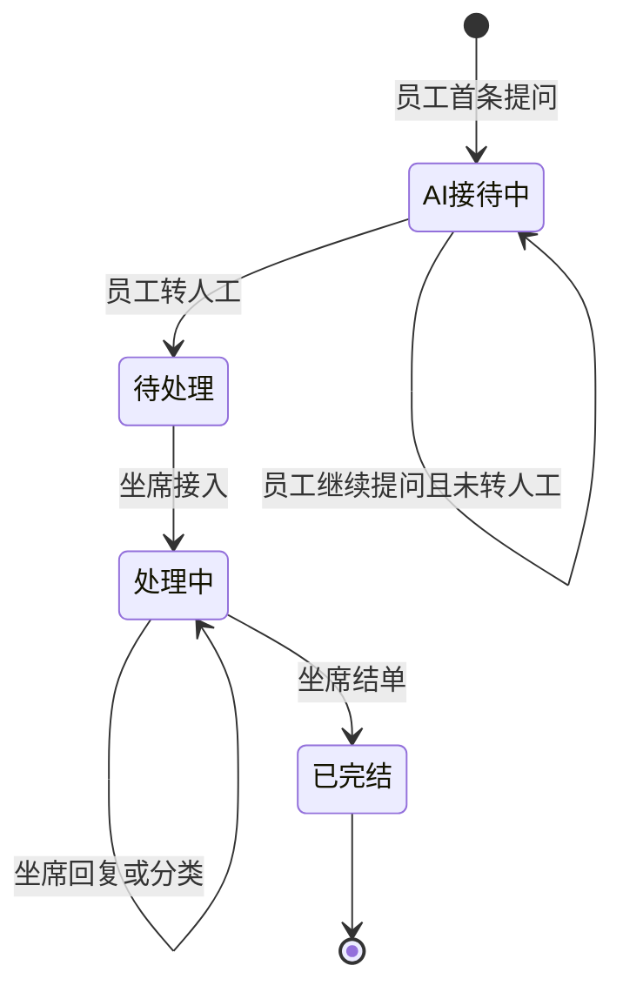
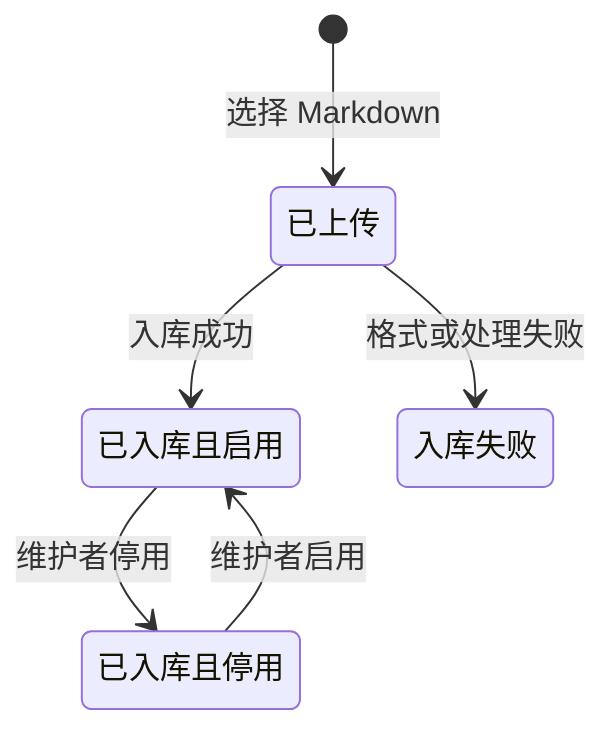

# 领域模型

## 1. 业务对象

| 对象 | 业务含义 | 创建者 | 生命周期 | 来源 Feature |
|---|---|---|---|---|
| 账号 | 登录身份；挂长期画像 | F-002（亦可预置） | 有效（MVP 不停用） | F-001 / F-002 / F-004 |
| 登录状态 | 当前已识别的访问身份 | F-001 | 未登录 → 已登录 → 退出 | F-001 / F-003 |
| 咨询工单 | 一次提问服务的全过程 | F-004 | AI 接待中 → 待处理 → 处理中 → 已完结 | F-004～F-011 |
| 消息 | 工单中的一句内容（员工 / 系统 / 坐席） | F-004 / F-008 | 随工单保存，MVP 不可删除 | F-004 / F-005 / F-008 |
| 工单分类 | 坐席给工单打的业务标签 | F-010 | 未分类 → 已分类；可改到结单为止 | F-010 / F-011 |
| 建议答复 | 坐席智能回答产生的、尚未发出的文本 | F-009 | 已生成 → 已采用发出 / 已丢弃；员工不可见 | F-009 / F-008 |
| 知识文档 | 一篇 Markdown 制度或说明 | F-012 | 已上传 → 已入库且启用 / 已入库且停用 / 入库失败 | F-012 / F-013 |
| 知识切片 | 文档切出的检索片段 | F-012 | 随文档存在；随文档启停是否可被检索 | F-012 / F-013 / F-004 / F-009 |
| 标准问答 | 用于高置信直接作答的问答对 | F-012 | 随所属文档启用才可匹配 | F-012 / F-013 / F-004 / F-009 |
| 长期画像 | 账号上少量稳定属性，只用于改写提问 | F-004 | 随对话轮次更新 | F-004 / F-009 |
| 短期记忆 | 当前工单最近 3 轮问答 | F-004 | 随新轮次滑动 | F-004 / F-009 |

## 2. 业务关系

| 对象 A | 关系 | 对象 B | 业务约束 |
|---|---|---|---|
| 账号 | 拥有 | 长期画像 | 一个账号一份画像；界面不展示、不可手工改 |
| 账号 | 发起 | 咨询工单 | 员工只能看到自己发起的工单 |
| 咨询工单 | 属于 | 账号 | 发起人在工单生命周期内不变 |
| 咨询工单 | 包含 | 消息 | 消息必须挂在唯一工单上；不允许无工单消息 |
| 咨询工单 | 可选具有 | 工单分类 | 结单前可改；结单后不再改 |
| 咨询工单 | 可选产生 | 建议答复 | 仅处理中工单可产生；未发出前不是消息 |
| 知识文档 | 包含 | 知识切片 | 切片不能脱离文档独立启停 |
| 知识文档 | 产生 | 标准问答 | 随文档入库产生；随文档启停 |
| 启用中的知识文档 | 供给 | 咨询工单的系统答复 | 停用文档不得参与后续匹配与生成 |

## 3. 状态机

### 咨询工单

禁止转换：

- 未转人工不得进入待处理（BR-006）
- 待处理不得跳过接入直接已完结
- 已完结不得回到任何可发言状态（BR-010）
- AI 接待中 / 待处理不得由坐席结单（须先接入）

### 知识文档

禁止：非 Markdown 进入已上传以外的成功入库；切片级单独启停。

## 4. 数据责任矩阵

| 业务对象 | Owner Feature | 创建 Feature | 写入 Feature | 读取 Feature | 删除/归档 Feature |
|---|---|---|---|---|---|
| 账号 | F-002 | F-002 | F-002 | F-001, F-004, F-009 | MVP 不删除 |
| 长期画像 | F-004 | F-004 | F-004 | F-004, F-009 | 随账号，不单独删 |
| 咨询工单 | F-004 | F-004 | F-006, F-007, F-010, F-011 | F-004～F-011 | MVP 不删除 |
| 消息 | F-004 | F-004, F-008 | 无（不改历史句） | F-004, F-005, F-007, F-008, F-009 | MVP 不删除 |
| 工单分类 | F-010 | F-010 | F-010 | F-007, F-010, F-011 | 结单后只读 |
| 建议答复 | F-009 | F-009 | F-009 | F-009；F-008 仅在坐席选择发出时读取 | 发出或丢弃后不再对员工可见 |
| 知识文档 | F-012 | F-012 | F-013 | F-012, F-013, F-004, F-009 | MVP 不删除，用停用代替 |
| 知识切片 | F-012 | F-012 | 无 | F-004, F-009（仅启用文档） | 随文档 |
| 标准问答 | F-012 | F-012 | 无 | F-004, F-009（仅启用文档） | 随文档 |

## 5. 跨 Feature 数据流

| 起点 Feature | 产生结果 | 下游 Feature | 使用方式 | 不变量 |
|---|---|---|---|---|
| F-002 | 有效账号 | F-001 | 用凭证登录 | 未注册且无预置账号则无法登录 |
| F-001 | 已登录身份 | F-003～F-013 | 识别当前用户 | 未登录不得使用工作台 |
| F-004 | AI 接待中工单与消息 | F-005, F-006 | 续聊、转人工 | 每条对话必有工单；员工只看自己的 |
| F-004 | 更新后的长期画像 | F-004, F-009 | 改写提问 | 画像不展示、不手工改 |
| F-006 | 待处理工单 | F-007 | 坐席接入 | 未转人工的工单对坐席不可见 |
| F-007 | 处理中工单 | F-008～F-011 | 回复、建议、分类、结单 | 接入后系统不再自动对外发言 |
| F-009 | 建议答复 | F-008 | 坐席确认后才成为消息 | 建议不是员工可见消息 |
| F-012 | 已入库且启用的知识 | F-004, F-009, F-013 | 答疑使用；可被停用 | 默认启用 |
| F-013 | 停用后的文档 | F-004, F-009 | 后续提问不得匹配或引用 | 停用立即生效，文档仍在列表中 |
