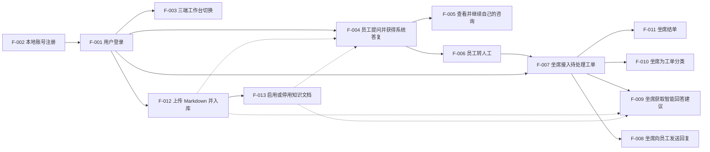

# Feature Map

## 1. Feature 总览

| Feature | 用户结果 | 角色 | 来源需求 | 依赖 | MVP/V2+ | Spec 状态 |
|---|---|---|---|---|---|---|
| F-001 用户登录 | 提交有效凭证后进入系统，身份可识别 | 内部用户 | S-001 | 无 | MVP | Ready |
| F-002 本地账号注册 | 尚未有账号的人获得可登录账号 | 内部用户 | S-001 | 无 | MVP | Ready |
| F-003 三端工作台切换 | 同一登录下在员工 / 坐席 / 知识维护之间切换 | 内部用户 | S-009, BR-014 | F-001 | MVP | Ready |
| F-004 员工提问并获得系统答复 | 形成工单并得到直出 / 反问 / 生成答复 | 员工 | S-002, BR-001～005, BR-016 | F-001 | MVP | Ready |
| F-005 查看并继续自己的咨询 | 看到自己的历史；未完结可续、已完结只读 | 员工 | S-003, BR-009～011, BR-013 | F-004 | MVP | Ready |
| F-006 员工转人工 | 工单进入待处理，坐席可见，上下文保留 | 员工 | S-004, BR-006 | F-004 | MVP | Ready |
| F-007 坐席接入待处理工单 | 工单变为处理中，系统停止自动对外发言 | 坐席 | S-005, BR-007 | F-001, F-006 | MVP | Ready |
| F-008 坐席向员工发送回复 | 员工在同一咨询中看到人工消息 | 坐席 | S-005 | F-007 | MVP | Ready |
| F-009 坐席获取智能回答建议 | 坐席看到建议；员工侧看不到未发出内容 | 坐席 | S-006, BR-008 | F-007 | MVP | Ready |
| F-010 坐席为工单分类 | 工单带有业务标签 | 坐席 | S-007 | F-007 | MVP | Ready |
| F-011 坐席结单 | 工单已完结，双方不能再发 | 坐席 | S-007, BR-009, BR-010 | F-007 | MVP | Ready |
| F-012 上传 Markdown 并入库 | 文档入库且默认启用，可供答疑使用 | 知识维护者 | S-008, BR-012, BR-015 | F-001 | MVP | Ready |
| F-013 启用或停用知识文档 | 启停立即影响后续答疑，文档不删除 | 知识维护者 | S-010, BR-016 | F-012 | MVP | Ready |
| F-014 按角色分权 | 员工 / 坐席 / 知识管理员入口互斥 | 管理员 | V2+ 分权 | F-001 | V2+ | 延后：先跑通三端 |
| F-015 技能组派单 | 按 IT / 行政分派待处理工单 | 坐席 | V2+ 派单 | F-006 | V2+ | 延后：先集中一个坐席台 |
| F-016 重开已完结工单 | 已完结咨询恢复可发言 | 员工 / 坐席 | V2+ 重开 | F-011 | V2+ | 延后：避免状态混乱 |
| F-017 企微 / 飞书入口 | 在即时通讯中完成咨询 | 员工 | V2+ 渠道 | F-004 | V2+ | 延后：先独立 Web |
| F-018 服务报表与满意度 | 看到服务量与评价 | 管理者 | V2+ 报表 | F-011 | V2+ | 延后：不解决找不到人 |
| F-019 多格式知识与权限目录 | 非 Markdown 入库且按目录授权 | 知识维护者 | V2+ 知识 | F-012 | V2+ | 延后：先跑通 .md |

## 2. Feature 依赖图

虚线表示「启用中的知识被答疑使用」，不是开工前置：无知识时 F-004 / F-009 仍可运行（反问或无依据时走降级）。

F-002 不强制作为 F-001 的唯一账号来源：系统也可预置账号。自助获得账号的路径是 F-002 → F-001。

## 3. Feature 与页面/视图候选关系

| Feature | 需要的用户入口 | 可能承载页面/视图 | 是否跨页面 |
|---|---|---|---|
| F-001 | 登录入口 | 登录页 | 否 |
| F-002 | 注册入口 | 登录页上的注册视图，或独立注册页 | 可与登录同页 |
| F-003 | 工作台切换入口 | 员工 / 坐席 / 知识维护各工作台的公共导航 | 是 |
| F-004 | 发送问题入口 | 员工咨询工作台（对话区） | 否 |
| F-005 | 历史咨询列表 | 员工咨询工作台（列表 + 对话） | 否 |
| F-006 | 转人工入口 | 员工咨询工作台（当前对话） | 否 |
| F-007 | 待处理工单列表与接入 | 坐席接待工作台（列表 + 对话） | 否 |
| F-008 | 坐席发送入口 | 坐席接待工作台（对话输入） | 否 |
| F-009 | 智能回答入口 | 坐席接待工作台（建议区，不进入员工对话） | 否 |
| F-010 | 分类入口 | 坐席接待工作台（当前工单） | 否 |
| F-011 | 结单入口 | 坐席接待工作台（当前工单） | 否 |
| F-012 | 上传入口 | 知识维护工作台 | 否 |
| F-013 | 文档列表上的启用 / 停用 | 知识维护工作台 | 否 |

页面不能决定 Feature 边界：员工工作台同时承载 F-003 / F-004 / F-005 / F-006；坐席工作台同时承载 F-003 / F-007～F-011；知识工作台同时承载 F-003 / F-012 / F-013。

## 4. Feature 与业务数据关系

| Feature | 读取业务对象 | 创建业务对象 | 修改业务对象 | 关键状态变化 |
|---|---|---|---|---|
| F-001 | 账号 | 无 | 无（建立登录状态，非业务对象字段） | 无登录 → 已登录 |
| F-002 | 无（校验账号是否已被占用） | 账号 | 无 | 无账号 → 有效账号 |
| F-003 | 登录状态 | 无 | 无 | 当前工作台变更 |
| F-004 | 账号、长期画像、工单、消息、启用中的知识文档 / 切片 / 标准问答 | 咨询工单、消息 | 长期画像；工单保持 AI 接待中 | 无工单 → AI 接待中；追加消息 |
| F-005 | 咨询工单、消息 | 无 | 无（续聊发问由 F-004 处理） | 无 |
| F-006 | 咨询工单、消息 | 无 | 咨询工单 | AI 接待中 → 待处理 |
| F-007 | 咨询工单、消息 | 无 | 咨询工单 | 待处理 → 处理中 |
| F-008 | 咨询工单、消息 | 消息 | 无 | 追加坐席消息 |
| F-009 | 咨询工单、消息、账号画像、启用中的知识 | 建议答复（仅坐席可见，未发出） | 无 | 无工单状态变化 |
| F-010 | 咨询工单 | 无 | 工单分类 | 分类被写入或更新 |
| F-011 | 咨询工单 | 无 | 咨询工单 | 处理中 → 已完结 |
| F-012 | 无 | 知识文档、知识切片、标准问答 | 无 | 未生效 → 已入库且启用 |
| F-013 | 知识文档 | 无 | 知识文档 | 启用 ⇄ 停用 |

## 5. 范围追踪

| PRD 场景/规则 | 覆盖 Feature | 覆盖状态 |
|---|---|---|
| S-001 | F-001, F-002 | 完整 |
| S-002 | F-004 | 完整 |
| S-003 | F-005 | 完整 |
| S-004 | F-006 | 完整 |
| S-005 | F-007, F-008 | 完整 |
| S-006 | F-009 | 完整 |
| S-007 | F-010, F-011 | 完整 |
| S-008 | F-012 | 完整 |
| S-009 | F-003 | 完整 |
| S-010 | F-013 | 完整 |
| BR-001～005 | F-004 | 完整 |
| BR-006 | F-006 | 完整 |
| BR-007 | F-007 | 完整 |
| BR-008 | F-009 | 完整 |
| BR-009, BR-010 | F-005, F-011 | 完整 |
| BR-011 | F-005, F-007 | 完整 |
| BR-012, BR-015 | F-012 | 完整 |
| BR-013 | F-005 | 完整 |
| BR-014 | F-003 | 完整 |
| BR-016 | F-004, F-009, F-013 | 完整 |
| V2+ 分权 / 派单 / 重开 / 渠道 / 报表 / 多格式 | F-014～F-019 | 仅登记，本轮不开发 |
